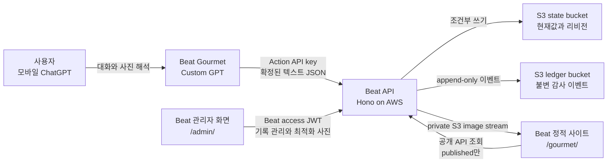
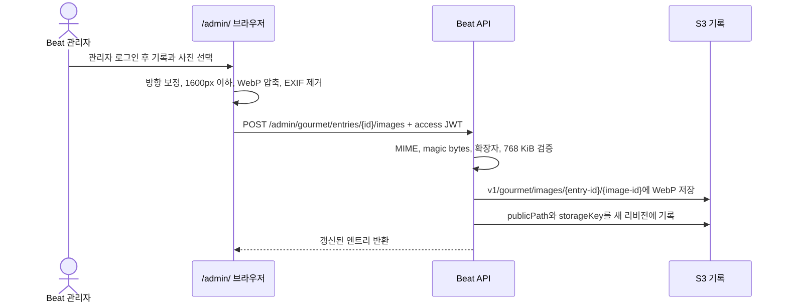

# Beat Gourmet 연계 흐름

이 문서는 모바일 ChatGPT에서 식사 내용을 정리한 뒤 Beat에 저장하고,
관리자가 사진을 S3에 보관하며, 최종적으로 포트폴리오의 `gourmet` 화면에서
공개하는 전체 연결을 설명한다. 운영 중 문제가 생기면
어느 경계에서 실패했는지 이 문서를 기준으로 확인한다.

구현의 핵심 원칙은 다음과 같다.

- 구조화된 식사 기록의 원본은 S3다.
- ChatGPT Action은 확인된 텍스트만 저장하고 사진 바이트는 보내지 않는다.
- 관리자가 브라우저에서 최적화한 사진은 private S3 state bucket에 저장한다.
- 공개 화면은 S3의 `published` 기록과 API가 전달하는 S3 이미지만 보여준다.
- Custom GPT와 Beat 관리자는 서로 다른 인증 수단을 사용한다.

## 한눈에 보는 연결 관계



사진을 ChatGPT 대화에 첨부하는 것과 Beat의 S3 기록에 저장하는 것은 별개의
단계다. ChatGPT는 사진을 보고 메뉴를 이해하는 데 사용할 수 있지만, 현재
Action 계약에는 원본 파일 바이트를 Beat API로 전달하는 필드가 없다. 따라서
Action은 확인된 텍스트만 저장하고, 사진은 관리자가 `/admin/`에서 다시 선택한다.

## 인증 주체와 권한

| 주체 | Bearer 값 | 저장 위치 | 허용 작업 | 금지 작업 |
| --- | --- | --- | --- | --- |
| 일반 방문자 | 없음 | 없음 | `published` 목록·상세·이미지 조회 | 초안 조회, 생성, 수정, 보관, 이미지 업로드 |
| Custom GPT Action | `BEAT_GOURMET_ACTION_API_KEY` | OpenAI GPT Action 인증 설정과 API 런타임 시크릿 | 기록 조회·생성·수정, 최근 맥락 조회 | 보관, 이미지 업로드, 관리자 로그인 |
| Beat 관리자 | Beat ES256 access JWT | 브라우저 `localStorage('beat-admin-session')` | 전체 상태 조회·생성·수정·보관, 이미지 업로드 | S3 자격 증명 직접 사용 |
| Beat API | Lambda 실행 역할 | AWS 런타임 | S3 기록·이미지 읽기/쓰기 | 자격 증명을 브라우저나 Action에 노출 |

관리자는 포트폴리오의 `/admin/`에서 Google SSO로 로그인한다. Beat의 OIDC
Authorization Code + PKCE 흐름이 Google 계정을 확인한 뒤 access token과
refresh token을 발급한다. 브라우저는 access token 만료가 60초 이내로 남으면
`/auth/token`으로 refresh token을 갱신하고, API는 관리자 요청의 access JWT를
검증하며 세션 쿠키를 사용하지 않는다. 로그아웃할 때는 로컬 저장값을 먼저
지운 뒤 `/auth/revoke`로 refresh token을 폐기한다. 기존 `/auth/login` API는
하위 호환을 위해 유지하지만 포트폴리오 UI에서는 사용하지 않는다.

Action API key는 관리자 JWT가 아니다. API가 고정 시간 비교로 두 자격 증명을
구분하므로 Action key를 알아도 기록을 보관하거나 이미지를 업로드할 수 없다.

## 1. ChatGPT에서 텍스트 기록 저장

### 사전 맥락 조회

추천이나 과거 취향이 필요한 경우 Custom GPT는 먼저 다음 요청을 호출한다.

```http
GET /api/gourmet/context?days=30&limit=30 HTTP/1.1
Host: api.example.com
Authorization: Bearer <BEAT_GOURMET_ACTION_API_KEY>
```

API는 최근 `published` 기록만 모아 평균 평점, 자주 등장한 태그와 최근 기록을
반환한다. GPT는 응답에 없는 취향을 추측해 저장 근거로 사용하면 안 된다.

### 사용자 확인과 생성 요청

GPT는 식당, 메뉴, 방문일, 평점, 재방문 여부, 요약과 선택 태그를 정리해 사용자에게
전체 내용을 보여준다. 사용자가 명시적으로 확인한 뒤에만 다음 요청을 보낸다.

```http
POST /api/gourmet/entries HTTP/1.1
Host: api.example.com
Authorization: Bearer <BEAT_GOURMET_ACTION_API_KEY>
Content-Type: application/json
Idempotency-Key: chatgpt-conversation-123-confirmed-1

{
  "restaurantName": "을지면옥",
  "restaurantBranch": null,
  "menuName": "평양냉면",
  "area": "서울 중구",
  "visitedAt": "2026-08-05",
  "rating": 8.5,
  "revisit": "yes",
  "summary": "담백한 육수와 단정한 면이 오래 남은 식사",
  "source": "chatgpt",
  "status": "published",
  "cuisineTags": ["한식", "평양냉면"],
  "ingredients": ["메밀"],
  "cookingMethods": [],
  "tasteNotes": ["담백함"],
  "nutritionTags": [],
  "liked": ["육수", "면"],
  "discoveries": [],
  "postMealNotes": [],
  "externalRequestId": null,
  "freeTextNote": null
}
```

성공하면 API는 `201 Created`와 함께 저장된 엔트리 및 정적 상세 링크를 반환한다.

```json
{
  "status": "saved",
  "detailUrl": "https://example.com/gourmet/?entry=euljimyeonok-12345678",
  "entry": {
    "id": "...",
    "slug": "euljimyeonok-12345678",
    "revision": 1,
    "status": "published",
    "images": []
  }
}
```

### API와 S3 내부 처리

1. API는 Bearer 값을 Action key 또는 관리자 access JWT로 인증한다.
2. 요청 JSON을 엄격한 스키마로 검증한다. 알 수 없는 필드, 범위를 벗어난 평점,
   24개를 넘는 배열은 `400`으로 거절한다.
3. `Idempotency-Key`와 요청 본문의 지문으로 엔트리 ID를 결정한다.
4. state bucket의
   `<state-prefix>/gourmet/entries/<id>/head.json`을 `If-None-Match: *`로 만든다.
5. 같은 경로 아래 `revisions/1.json`을 별도로 저장한다.
6. ledger bucket의 날짜별 `v1/events/gourmet/...json`에 생성 이벤트와 본문
   digest를 추가한다. ledger 보존 설정이 있으면 Object Lock이 적용된다.

동일한 key와 동일한 본문을 다시 보내면 기존 엔트리를 반환하므로 네트워크 재시도가
중복 식사를 만들지 않는다. 같은 key에 다른 본문을 보내면 `409 Conflict`다.

## 2. ChatGPT 또는 관리자에서 기록 수정

수정 전 `GET /api/gourmet/entries/{id-or-slug}`로 최신 엔트리를 읽고 현재
`revision`을 기억한다. 사용자가 수정 내용을 확인하면 필요한 필드와
`expectedRevision`만 보낸다.

```http
PATCH /api/gourmet/entries/euljimyeonok-12345678 HTTP/1.1
Authorization: Bearer <ACTION_KEY_OR_ADMIN_ACCESS_JWT>
Content-Type: application/json

{
  "expectedRevision": 1,
  "rating": 9,
  "liked": ["육수", "면", "수육"]
}
```

API는 `head.json`의 ETag를 `If-Match`에 넣어 조건부 갱신하고
`revisions/2.json`과 감사 이벤트를 추가한다. 다른 관리자나 Action이 먼저
저장했다면 revision 또는 ETag가 달라지므로 `409`를 반환한다. 클라이언트는 최신
기록을 다시 읽고 변경안을 다시 확인해야 하며, 마지막 쓰기로 덮어쓰면 안 된다.

보관은 `DELETE /api/gourmet/entries/{id-or-slug}`이며 관리자 access JWT만
허용된다. 실제 S3 객체를 삭제하지 않고 상태를 `deleted`로 바꾸는 soft delete다.

## 3. 관리자가 사진을 S3에 저장



브라우저 처리 순서는 다음과 같다.

1. 관리자가 `/admin/`에 로그인하고 Gourmet 기록을 선택한다.
2. `S3에 사진 저장`에서 JPEG, PNG 또는 WebP를 선택한다.
3. `createImageBitmap(..., { imageOrientation: "from-image" })`으로 휴대폰 방향을
   반영한다.
4. 긴 변을 최대 1,600px로 줄이고 WebP 품질과 해상도를 단계적으로 낮춰
   700KiB 이하로 만든다.
5. 새 canvas에서 만든 바이트만 전송하므로 원본 EXIF와 GPS 메타데이터는 남지
   않는다.
6. base64 JSON을 관리자 access JWT와 함께 다음 경로로 전송한다.

```http
POST /admin/gourmet/entries/{id}/images HTTP/1.1
Authorization: Bearer <BEAT_ADMIN_ACCESS_JWT>
Content-Type: application/json

{
  "altText": "을지면옥 평양냉면",
  "contentBase64": "UklGR...",
  "contentType": "image/webp",
  "originalFilename": "meal.webp"
}
```

API는 base64를 디코딩한 뒤 선언된 MIME, 실제 magic bytes, 확장자와 768KiB
상한을 다시 검증한다. 통과하면 서버의 Lambda 역할로 private state bucket에
다음 키로 저장한다.

- 저장 경로: `v1/gourmet/images/<entry-id>/<image-id>`
- 객체 메타데이터: 원본 파일명(퍼센트 인코딩)
- 캐시: `public, max-age=31536000, immutable`

이미지 ID는 엔트리 ID와 이미지 바이트의 SHA-256 digest에서 결정된다. 같은 사진을
다시 보내면 같은 이미지로 판단해 같은 객체를 가리키는 idempotent 기록이 된다.
이미지 공개 경로는 `/api/gourmet/images/{entry-id}/{image-id}`이며, API는
`published` 엔트리의 이미지와 안전한 S3 key만 스트리밍한다. 저장 직후에도
비공개·초안 엔트리의 이미지는 공개되지 않는다.

관리자가 잘못 올린 사진을 기록에서 분리하려면 다음 요청을 보낸다.

```http
GET /admin/gourmet/entries/{id-or-slug}/images/{image-id} HTTP/1.1
Authorization: Bearer <BEAT_ADMIN_ACCESS_JWT>

DELETE /admin/gourmet/entries/{id-or-slug}/images/{image-id} HTTP/1.1
Authorization: Bearer <BEAT_ADMIN_ACCESS_JWT>
```

첫 번째 요청은 `private, no-store` 응답으로 초안 사진을 관리자 브라우저에서만
미리보게 한다. 두 번째 작업은 조건부 리비전 갱신으로 이미지 메타데이터만 제거한다. API 역할에는
`s3:DeleteObject`가 없으므로 private S3 객체와 버전은 복구를 위해 보존된다.
메타데이터가 사라진 뒤에는 엔트리가 공개 상태여도 해당 이미지 스트림이
`404`를 반환한다. 초안의 이미지는 공개 URL 대신 위의 인증된 관리자 스트림으로만
미리 볼 수 있다.

## 4. 정적 사이트에서 공개

`/gourmet/`, `/en/gourmet/`, `/ja/gourmet/`는 빌드 시점에 모든 식사 데이터를
포함하지 않는 정적 client shell이다. 브라우저가 실행되면 프로덕션
`NEXT_PUBLIC_API_URL`로 다음 요청을 보낸다.

```text
GET /api/gourmet/entries?pageSize=48
GET /api/gourmet/entries/{slug}
```

인증 없는 요청은 API가 강제로 `published`만 반환한다. 상세 주소는 새 S3 레코드를
Next.js 빌드가 미리 알 수 없기 때문에 `/gourmet/?entry={slug}`를 사용한다. 공개
이미지는 API의 공개 스트림 경로에서 제공되며, 브라우저에는 S3 자격 증명을 전달하지
않는다.

```text
GET /api/gourmet/images/{entry-id}/{image-id}
If-None-Match: "<etag>"
```

텍스트 수정과 사진 추가는 모두 S3에 저장되는 즉시 공개 API에 반영된다. 단, 공개
시점은 엔트리가 `published`로 확정된 뒤이며, 이미지 자체는 private bucket에 남고
API가 권한 경계를 대신 집행한다.

## 프로덕션 설정 순서

이 PR 자체는 AWS나 사이트를 배포하지 않는다. 프로덕션 운영자는 다음 순서로
연결한다.

1. Beat의 state bucket과 Object Lock ledger bucket을 포함한 AWS 스택을 준비한다.
2. API가 사용하는 Secrets Manager JSON에 아래 값을 모두 저장한다.
   - `BEAT_AUTH_LOOKUP_SECRET`
   - `BEAT_AUTH_ISSUER_URL`
   - `BEAT_AUTH_AUDIENCE`
   - `BEAT_AUTH_SIGNING_PRIVATE_JWK`
   - `BEAT_AUTH_SIGNING_KEY_ID`
   - `BEAT_GOURMET_ACTION_API_KEY`
   - `GITHUB_APP_ID`
   - `GITHUB_APP_INSTALLATION_ID`
   - `GITHUB_APP_PRIVATE_KEY`
   - `GITHUB_CONTENT_REPOSITORY`
3. API를 먼저 배포하고 HTTPS origin과 private state bucket 접근 권한을
   확인한다.
4. `NEXT_PUBLIC_API_URL`과 `NEXT_PUBLIC_SITE_URL`을 프로덕션 origin으로 고정하고
   `API_CORS_ORIGINS`에는 정확한 포트폴리오 origin만 허용한다.
5. 관리자 계정을 만든 뒤 `/admin/` 로그인, 자동 refresh, 기록 생성·수정·보관을
   확인한다.
6. [`gourmet-action.openapi.yaml`](gourmet-action.openapi.yaml)의
   `https://api.example.com`을 실제 API origin으로 바꿔 Custom GPT Action에
   등록한다.
7. GPT Action 인증을 API Key, Bearer로 설정하고 서버와 동일한
   `BEAT_GOURMET_ACTION_API_KEY`를 입력한다.
8. Action Preview에서 context, create, idempotent replay, get, update를 확인한다.
9. 관리자 화면에서 사진을 S3에 저장하고, 공개로 확정한 엔트리에서 이미지가
   API 경로로 로드되는지 확인한다.
10. 배포 완료 후 한국어·영어·일본어 Gourmet 목록, 상세 링크와 사진을 모바일에서
    확인한다.

실제 Custom GPT 등록 절차와 권장 지시문은
[`gourmet-custom-gpt.md`](gourmet-custom-gpt.md)를 따른다.

## 장애 위치 확인

| 증상 | 확인할 경계 | 조치 |
| --- | --- | --- |
| Action이 `401` 반환 | GPT Action Bearer key | Action 인증 유형과 API 런타임의 `BEAT_GOURMET_ACTION_API_KEY`가 같은지 확인 |
| Action으로 보관·사진 요청이 `403` | 권한 분리 | 정상 동작이다. Beat 관리자 JWT로 `/admin/`에서 수행 |
| 생성이 `409` | idempotency | 같은 key에 다른 본문을 쓰지 말고, 확정 메시지마다 안정적인 새 key 사용 |
| 수정이 `409` | revision/ETag | 최신 엔트리를 다시 읽고 사용자에게 수정안을 다시 확인 |
| 요청이 `400` | 입력 스키마 또는 이미지 검증 | 평점 단위, 필수 문자열, 배열 수, MIME·확장자·크기를 확인 |
| API가 `500` | S3 설정 또는 IAM | request ID로 로그를 찾고 bucket 환경값과 Lambda 역할의 state prefix 권한 확인 |
| 공개 목록에 기록이 없음 | 공개 상태 | 엔트리가 `published`인지 관리자 화면에서 확인 |
| 이미지가 표시되지 않음 | 공개 상태 또는 이미지 key | 엔트리가 `published`인지, `storageKey`가 `v1/gourmet/images/` 아래인지, API 응답이 200인지 확인 |
| 사진을 분리했는데 S3 객체가 남아 있음 | 의도된 복구 경계 | 기록 리비전에서 메타데이터가 제거됐는지와 공개 이미지가 `404`인지 확인한다. 객체 삭제는 운영 역할에 허용하지 않는다 |
| 관리자 로그인이 반복 만료 | JWT refresh | 로컬 session의 refresh 만료, `/auth/token`, issuer/audience 설정 확인 |

API key, JWT, refresh token, GitHub App private key, installation token은 로그와
PR에 포함하면 안 된다. 장애 공유에는 응답의 `requestId`, HTTP 상태, 발생 시각과
엔트리 ID만 사용한다.

## 구현 파일 지도

- API 라우트와 권한 분리: [`apps/api/src/gourmet-routes.ts`](../apps/api/src/gourmet-routes.ts)
- S3 리비전·감사 이벤트와 이미지 저장/스트림: [`apps/api/src/gourmet.ts`](../apps/api/src/gourmet.ts)
- GitHub App token 발급: [`apps/api/src/github-app.ts`](../apps/api/src/github-app.ts)
- Custom GPT OpenAPI 계약: [`gourmet-action.openapi.yaml`](gourmet-action.openapi.yaml)
- 관리자 access/refresh token 처리: [`apps/web/src/lib/beat-admin-session.ts`](../apps/web/src/lib/beat-admin-session.ts)
- 관리자 기록·사진 화면: [`apps/web/src/components/admin/gourmet-manager.tsx`](../apps/web/src/components/admin/gourmet-manager.tsx)
- 공개 목록·상세·사진 fallback: [`apps/web/src/components/gourmet/gourmet-browser.tsx`](../apps/web/src/components/gourmet/gourmet-browser.tsx)
- 프로덕션 시크릿 로딩: [`.github/workflows/deploy-reusable.yml`](../.github/workflows/deploy-reusable.yml)
