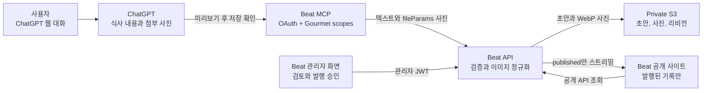

# Beat Gourmet 연계 흐름

ChatGPT 대화에 있는 식사 내용과 사진을 Beat Gourmet 초안으로 저장하고,
관리자가 검토한 뒤 공개하는 흐름이다. 기록과 사진은 Beat의 private S3에
저장되며 공개 API는 `published` 기록만 노출한다.

## 연결 관계

## 인증과 권한

| 주체 | 인증 | 가능한 작업 |
| --- | --- | --- |
| 방문자 | 없음 | 공개된 기록과 이미지 조회 |
| ChatGPT MCP | OAuth Bearer JWT와 `gourmet:read` / `gourmet:write` | 공개 맥락 조회, 미리보기, 확인된 초안 생성, 이미지 첨부 |
| Beat 관리자 | Beat access JWT | 초안 검토, 편집, 발행, 보관, 사진 정리 |
| Beat API | Lambda 실행 역할 | S3 상태와 사진 읽기·쓰기 |

MCP에는 관리자 JWT 권한이 없다. MCP가 저장한 항목은 항상 `draft`이며
사진까지 저장되어도 자동 공개되지 않는다. 기존 `/admin/` 승인 흐름이
발행의 경계다. Custom GPT Action API 키와 해당 REST 경로는 제거되었다.

## 대화에서 초안 만들기

1. ChatGPT는 현재 대화에서 사용자가 제공한 식사 정보와 사진을 읽는다.
2. 필요하면 `gourmet_get_context`로 최근 공개 기록을 확인한다.
3. `gourmet_preview_import`로 텍스트 후보를 미리 보여 준다.
4. 사용자가 저장을 요청하면 ChatGPT가 `gourmet_confirm_import`에 식사 기록과
   해당 대화의 파일을 보낸다.
5. MCP는 OpenAI file parameter의 임시 URL을 HTTPS와 신뢰된 호스트 allowlist로
   검증한다. 모든 redirect도 검증한 뒤 제한된 바이트만 스트리밍한다.
6. MCP는 JPEG/PNG/WebP만 디코딩하고 EXIF 방향을 반영한 뒤 긴 변을 최대
   1,600px로 줄이고 메타데이터 없는 WebP를 700KiB 미만으로 만든다.
7. API가 이미지 전체를 먼저 최적화한 뒤 식사 기록을 초안으로 저장하고,
   매핑된 사진을 기존 content-hash S3 저장 경로로 붙인다.
8. 관리자가 `/admin/`에서 날짜, 식당, 평점, 기록, 사진을 확인한 뒤 발행을
   승인한다. 공개 사이트는 승인된 리비전만 읽는다.

사진은 `images` 배열 순서대로 연결한다. 식사가 하나면 모든 이미지가 해당
기록에 연결된다. 여러 식사를 한 번에 저장할 때는 이미지마다
`imageEntryIndexes`의 0 기반 식사 인덱스를 지정해야 한다. 수가 다르거나
범위를 벗어나면 데이터 저장 전에 거부한다. 한 번의 요청에는 최대 6장,
사진당 원본 12MiB, 전체 원본 30MiB 제한이 적용된다.

## 재시도와 실패 경계

사진을 모두 내려받고 정규화하기 전에 Gourmet 기록을 만들지 않는다. 따라서
잘못된 URL, 차단된 redirect, 너무 큰 파일, 지원하지 않는 포맷, 이미지 변환
실패는 초안 생성 전에 끝난다.

S3 저장 중 장애가 나면 텍스트 초안 일부 또는 사진 일부가 저장된 상태로
남을 수 있다. 같은 텍스트를 재시도하면 stable idempotency key가 같은 초안을
반환하고, S3가 이미지 콘텐츠 해시를 사용하므로 이미 붙은 사진은 중복되지
않는다. 미완성 사진만 다시 붙는다. 로그에는 사용자 주체와 기록/사진 개수만
남기며 식사 텍스트, 파일 URL/ID, 사진 바이트는 남기지 않는다.

## 프로덕션 운영과 한계

- `BEAT_MCP_RESOURCE`는 API 리소스 URL, `BEAT_AUTH_CLIENTS_JSON`은 ChatGPT의
  정확한 OAuth callback, 리소스, scope를 보유한다.
- 런타임 secret에는 Beat OIDC와 Google SSO 자격 증명, GitHub App 값만 둔다.
  Gourmet Action API key는 더 이상 필요하지 않다.
- 새 `images` 도구 정의가 배포되면 ChatGPT 커넥터에서 tool refresh를 해야
  할 수 있다. 이미 승인된 앱은 기존 도구 정의를 자동 갱신하지 않는다.
- OpenAI의 현재 안내는 전체 MCP 쓰기 지원을 Business/Enterprise/Edu에
  순차 제공하며 Pro는 read/fetch 전용이라고 설명한다. 실제 사용자의 플랜을
  이 문서만으로 추정하지 않는다.
- MCP 앱은 현재 ChatGPT 웹에서만 이용할 수 있고 모바일 앱은 지원되지 않는다.
  모바일에서는 기기에 사진을 저장한 다음 `/admin/`의 기존 사진 업로드를
  사용한다.
- 공개 연결이나 실제 대화 사진 전달은 ChatGPT에서 직접 검증해야 한다.
  Codex에 Beat MCP 커넥터 도구가 노출되지 않은 경우 Codex가 그 검증을 대신
  했다고 보고하지 않는다.

관련 절차는 [MCP 설정 안내](gourmet-chatgpt-mcp.md),
[API와 저장 설계](gourmet.md), [프로덕션 운영 런북](gourmet-production-runbook.md)을
참고한다.
